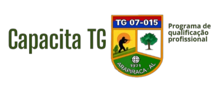

# Capacita TG



O projeto **Capacita TG** é uma plataforma web dedicada a oferecer qualificação profissional para Atiradores matriculados nos Tiros de Guerra. O objetivo é facilitar a inserção desses jovens no mercado de trabalho por meio de cursos gratuitos e parcerias com empresas locais.

## 📋 Índice

-   [Sobre o Projeto](#sobre-o-projeto)
-   [✨ Funcionalidades](#-funcionalidades)
-   [🚀 Tecnologias Utilizadas](#-tecnologias-utilizadas)
-   [🏁 Começando](#-começando)
    -   [Pré-requisitos](#pré-requisitos)
    -   [Instalação](#instalação)
-   [🔧 Uso e Desenvolvimento Local](#-uso-e-desenvolvimento-local)
    -   [Executando o Frontend](#executando-o-frontend)
    -   [Executando o Backend (API)](#executando-o-backend-api)
-   [🔑 Painel Administrativo](#-painel-administrativo)
-   [📁 Estrutura do Projeto](#-estrutura-do-projeto)
-   [🤝 Contribuições](#-contribuições)
-   [📄 Licença](#-licença)

## Sobre o Projeto

Esta plataforma serve como uma ponte entre os Atiradores dos Tiros de Guerra e o mercado de trabalho. Ela oferece um catálogo de cursos de qualificação profissional gratuitos, além de um portal para que empresas parceiras possam se cadastrar e encontrar mão de obra qualificada. O sistema conta com um painel administrativo para facilitar o gerenciamento dos cursos.

## ✨ Funcionalidades

-   ✅ **Site Institucional:** Apresentação do projeto, dos cursos e das empresas parceiras.
-   ✅ **Catálogo de Cursos:** Listagem de cursos divididos por categorias (Primeiro Emprego, Empreendedorismo, etc.).
-   ✅ **Carregamento Dinâmico:** Os cursos são carregados de forma dinâmica a partir de uma API, sem a necessidade de recarregar a página.
-   ✅ **Painel Administrativo:** Interface para administradores gerenciarem os cursos (criar, editar, visualizar e excluir).
-   ✅ **Filtros e Busca:** Funcionalidades de filtragem e busca de cursos no painel administrativo.

## 🚀 Tecnologias Utilizadas

O projeto é dividido em duas partes principais:

**Frontend:**

-   HTML5
-   CSS3
-   JavaScript (Vanilla)

**Backend (API):**

-   [Node.js](https://nodejs.org/)
-   [Express.js](https://expressjs.com/pt-br/)
-   [Vercel KV](https://vercel.com/storage/kv) como banco de dados (NoSQL)

## 🏁 Começando

Siga estas instruções para obter uma cópia do projeto e executá-lo em sua máquina local para desenvolvimento e testes.

### Pré-requisitos

Antes de começar, certifique-se de ter as seguintes ferramentas instaladas:

-   [Node.js](https://nodejs.org/) (versão 14.x ou superior)
-   [npm](https://www.npmjs.com/) (geralmente vem com o Node.js)

### Instalação

1.  **Clone o repositório:**
    ```bash
    git clone [https://github.com/wagnerxv/capacita-tg.git](https://github.com/wagnerxv/capacita-tg.git)
    cd capacita-tg
    ```

2.  **Instale as dependências da API:**
    ```bash
    cd api
    npm install
    cd ..
    ```

## 🔧 Uso e Desenvolvimento Local

### Executando o Frontend

O frontend é composto por arquivos estáticos (HTML, CSS, JS). Você pode servi-los com qualquer servidor web. Uma maneira fácil é usar a extensão **Live Server** no Visual Studio Code.

1.  Abra a pasta raiz do projeto no VS Code.
2.  Instale a extensão [Live Server](https://marketplace.visualstudio.com/items?itemName=ritwickdey.LiveServer).
3.  Clique com o botão direito no arquivo `index.html` e selecione "Open with Live Server".

### Executando o Backend (API)

A API foi projetada para funcionar com o Vercel KV, mas pode ser adaptada para rodar localmente com um arquivo JSON para facilitar o desenvolvimento.

#### Opção 1: Usando Vercel KV (Recomendado para simular o ambiente de produção)

1.  **Crie uma conta na [Vercel](https://vercel.com).**

2.  **Crie um banco de dados Vercel KV:**
    -   Vá para a aba "Storage" no seu dashboard da Vercel.
    -   Crie um novo "KV (Redis) Database".
    -   Após a criação, conecte-o a um projeto (pode ser um projeto novo ou existente).
    -   Clique em `.env.local` para ver as variáveis de ambiente. Você precisará delas.

3.  **Configure as variáveis de ambiente:**
    -   Na pasta `api`, crie um arquivo chamado `.env`.
    -   Copie as variáveis do Vercel KV para o seu arquivo `.env`:
        ```
        KV_URL=...
        KV_REST_API_URL=...
        KV_REST_API_TOKEN=...
        KV_REST_API_READ_ONLY_TOKEN=...
        ```

4.  **Inicie o servidor da API:**
    ```bash
    cd api
    npm run dev
    ```
    O servidor estará rodando em `http://localhost:3000` (ou outra porta, se configurado).

#### Opção 2: Usando o arquivo `courses.json` (Para desenvolvimento offline)

Para desenvolver sem a necessidade de uma conexão com o Vercel KV, você pode modificar a API para ler e escrever no arquivo `api/courses.json`.

1.  **Abra o arquivo `api/server.js` e comente as importações e funções do Vercel KV.**

2.  **Substitua as funções `readCourses` e `writeCourses` pelas seguintes:**
    ```javascript
    const fs = require('fs');
    const path = require('path');
    const COURSES_FILE = path.join(__dirname, 'courses.json');

    // Função para ler os cursos do arquivo JSON local
    async function readCourses() {
      try {
        const data = fs.readFileSync(COURSES_FILE, 'utf8');
        const jsonData = JSON.parse(data);
        return jsonData.courses || [];
      } catch (error) {
        console.error('Error reading courses from JSON file:', error);
        return [];
      }
    }

    // Função para escrever os cursos no arquivo JSON local
    async function writeCourses(coursesData) {
      try {
        const dataToWrite = JSON.stringify({ courses: coursesData }, null, 2);
        fs.writeFileSync(COURSES_FILE, dataToWrite, 'utf8');
        return true;
      } catch (error) {
        console.error('Error writing courses to JSON file:', error);
        return false;
      }
    }
    ```

3.  **Inicie o servidor da API normalmente:**
    ```bash
    cd api
    npm run dev
    ```

## 🔑 Painel Administrativo

O painel administrativo permite o gerenciamento completo dos cursos.

-   **URL:** `http://localhost:5500/admin/index.html` (ou a porta que o Live Server usar)
-   **Usuário:** `admin`
-   **Senha:** `capacita2025`

**Atenção:** As credenciais são fixas no código e não são seguras para um ambiente de produção.

## 📁 Estrutura do Projeto

```
/
├── admin/            # Arquivos do painel administrativo
│   ├── admin.css
│   ├── admin.js
│   ├── dashboard.html
│   └── index.html
├── api/              # Código do backend (API)
│   ├── server.js
│   ├── courses.json
│   └── package.json
├── src/              # Arquivos do frontend (site público)
│   ├── imgs/
│   ├── js/
│   │   ├── course-loader.js
│   │   ├── header-control.js
│   │   └── ...
│   └── style.css
├── index.html        # Página inicial
├── empreend.html     # Outras páginas de cursos
├── ...
└── vercel.json       # Configuração de deploy da Vercel
```
